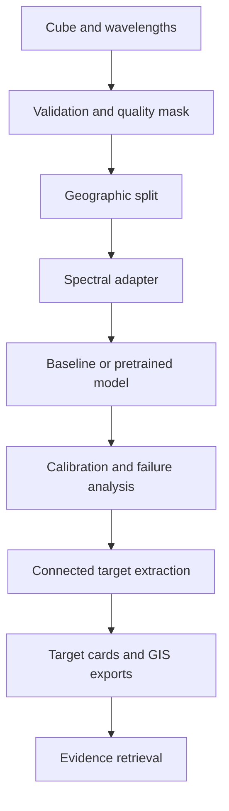

# Architecture

## Decision path

## Boundaries

### Data boundary

`HyperspectralCube` validates spatial shape, band count, wavelength order, masks, finite values,
and label alignment before model code receives an array.

### Split boundary

Scene or acquisition groups must be disjoint. Neighboring pixels from the same source scene cannot
appear across training and evaluation merely because they have different row or column indices.

### Model boundary

Every model adapter exposes a stable prediction contract and identifies whether it used random
initialization, frozen features, parameter-efficient adaptation, or full fine-tuning.

### Decision boundary

Per-pixel probabilities are calibrated before thresholding. Connected regions are ranked with an
explicit score using probability, uncertainty, spatial coherence, spectral agreement, and quality
penalties. A target card preserves each component instead of exposing only the final score.

### Evidence boundary

The retrieval layer reads signed or hashed artifacts emitted by prior stages. It cannot call the
ranking function or mutate model results.

